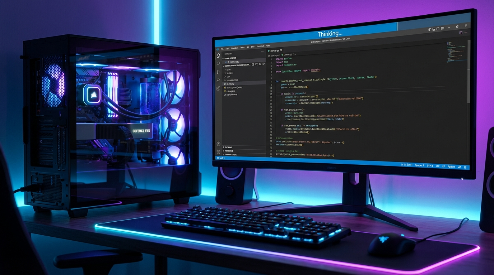

## Prompt

```text
A high-quality 3D render of a local AI development setup. In the center, a powerful workstation with a visible glowing RTX 3090 GPU inside a glass case. Connected is a monitor displaying a code editor with a 'Thinking...' status indicator. The lighting is moody with cyber-blue and neon-purple accents. Professional tech blog style, photorealistic, detailed textures.
```

## Image


