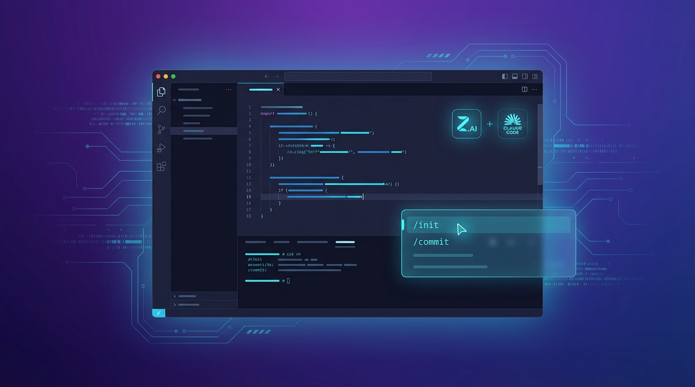

## Prompt

```text
A clean, modern tech blog hero image for "Careti v0.4.7 Update". Features: VS Code-style dark code editor interface with glowing code snippets, Z.AI and Claude Code logos subtly integrated, futuristic UI elements showing command palette with "/init" and "/commit" commands, abstract circuit patterns in the background. Color scheme: deep purple and blue gradients with cyan accents. Minimalist, professional, tech-focused design. Text-free image suitable for blog header. 16:9 aspect ratio.
```

## Image


