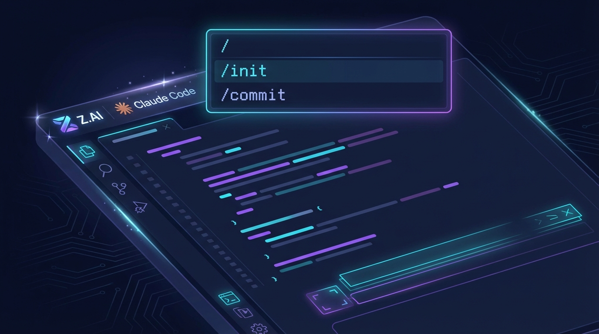

## Prompt

```text
Modern tech blog hero image for Careti v0.4.7 Update. Clean VS Code-style dark editor interface with code snippets. Features: command palette showing "/init" and "/commit" commands, Z.AI and Claude Code integration icons, futuristic UI elements with shimmer effects. Abstract circuit board patterns in background. Color palette: deep navy blue, purple gradients, cyan highlights. Professional minimalist design, no text. 16:9 ratio for blog header.
```

## Image


