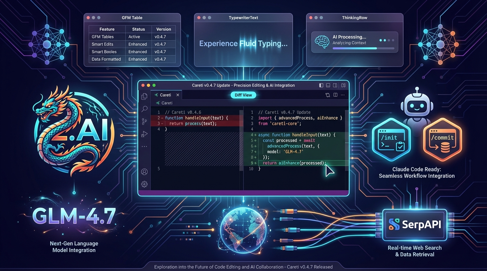

## Prompt

```text
Rich, detailed tech blog hero image for Careti v0.4.7 Update. Composition includes: 
1) Center: VS Code-style dark editor with glowing code and diff view showing precise editing
2) Left side: Z.AI logo with Chinese dragon motif, GLM-4.7 text floating
3) Right side: Claude Code compatibility icons with /init /commit command badges
4) Top: Sleek UI mockups showing GFM tables, TypewriterText shimmer animation, ThinkingRow components
5) Bottom: Web search globe icon with SerpAPI connection lines
6) Background: Complex circuit board patterns, data flow streams, neural network nodes
Color scheme: Deep space purple, electric cyan, warm orange accents on dark navy. Futuristic, feature-rich, professional. High detail, cyberpunk-lite aesthetic. 16:9 for blog header.
```

## Image


