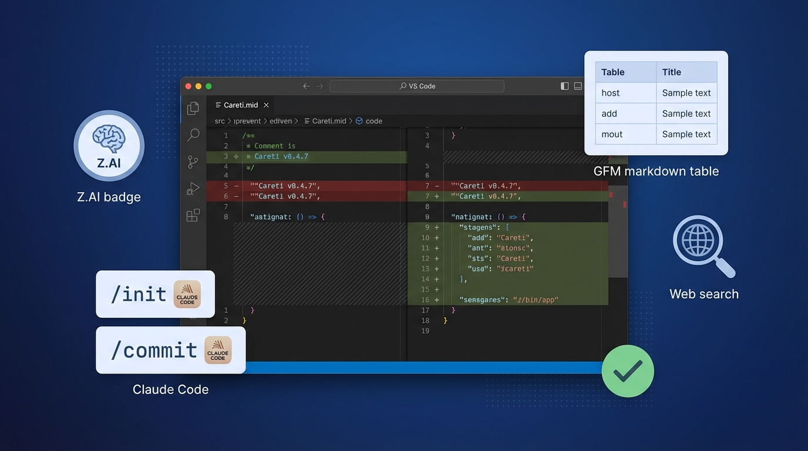

## Prompt

```text
Clean tech blog hero for Careti v0.4.7. VS Code dark editor in center with code diff showing precise edit. Simple feature icons around: Z.AI badge, Claude Code /init /commit buttons, table UI for GFM markdown, search icon for web search, checkmark for accuracy. Dark blue background with subtle gradient. Professional, clean, no dragons or robots. Modern flat design style. 16:9 blog header.
```

## Image


