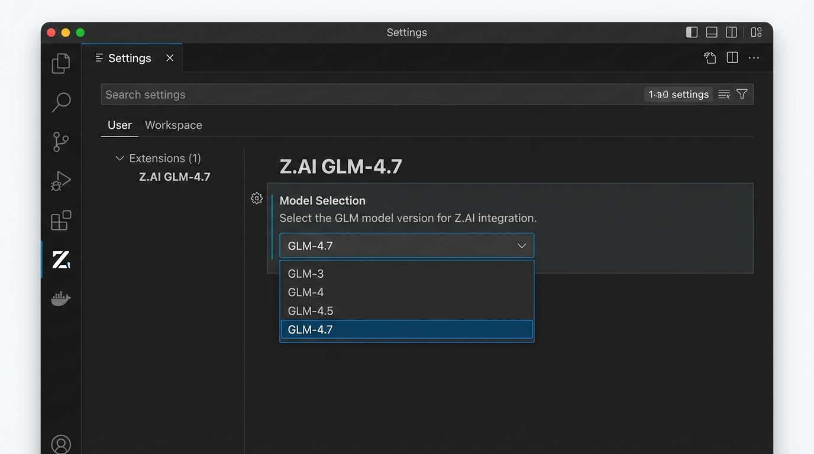

## Prompt

```text
A clean VS Code extension settings screenshot showing Z.AI GLM-4.7 model selection dropdown. Dark theme, modern UI, showing model list with GLM-4.7 highlighted. Simple, realistic software interface mockup.
```

## Image


