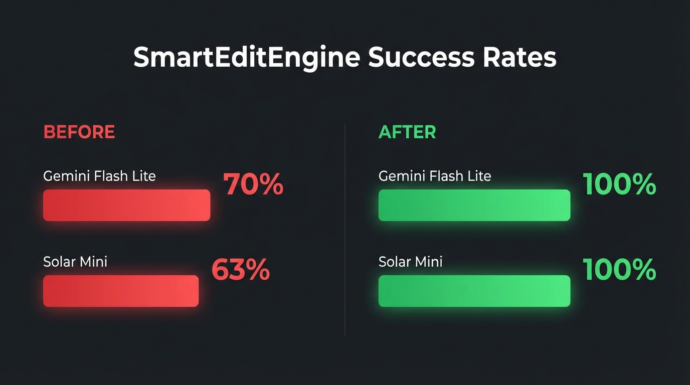

## Prompt

```text
A comparison chart showing SmartEditEngine success rates. Left side "Before" with red bars: Gemini Flash Lite 70%, Solar Mini 63%. Right side "After" with green bars: both at 100%. Clean infographic style, dark theme, minimal design with clear percentages.
```

## Image


